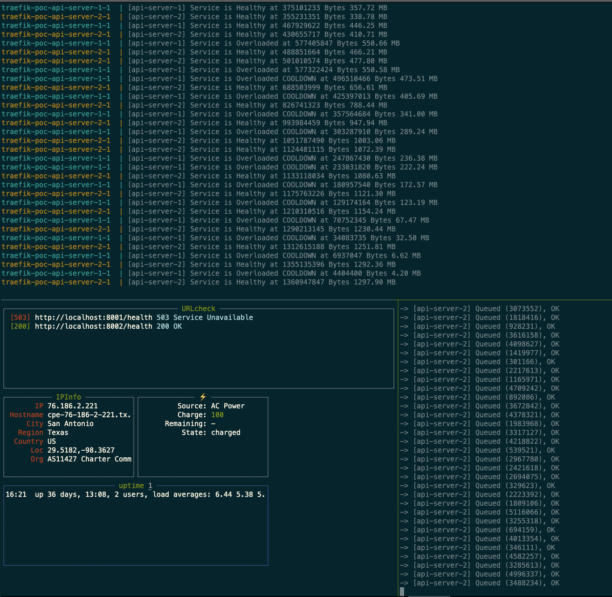

## Traefik POC
It Consists of a Traefik proxy with a single entrypoint, middleware, router and two backend servers

# Testing the 503 off loading
```bash
# Start Traefik with two api-server backends
$ docker-compose up -d

# Now generate some load by making requests through 
# Traefik to the api-server backends
$ go run ./cmd/client
```
<h2 align="center">
    <br />
</h2>

# Testing the Auth Middleware
```bash
$ docker-compose up

# Domain auth extracts the domain from the URL and injects the domain-id as a header in the upstream request
$ curl --user thrawn:password http://localhost:8085/v3/domains/thrawn01.org/info -H 'Host: api-server.com'
{
 "Message": "Domain Handler",
 "Domain": "thrawn01.org",
 "Headers": {
  "Accept": [
   "*/*"
  ],
  "Accept-Encoding": [
   "gzip"
  ],
  "Authorization": [
   "Basic dGhyYXduOnBhc3N3b3Jk"
  ],
  "User-Agent": [
   "curl/7.64.1"
  ],
  "X-Forwarded-For": [
   "172.25.0.1"
  ],
  "X-Forwarded-Host": [
   "api-server.com"
  ],
  "X-Forwarded-Port": [
   "80"
  ],
  "X-Forwarded-Proto": [
   "http"
  ],
  "X-Forwarded-Server": [
   "6580a49ac1d2"
  ],
  "X-Mailgun-Account-Id": [
   "account-id-01"
  ],
  "X-Mailgun-Domain-Id": [
   "domain-id-01"
  ],
  "X-Real-Ip": [
   "172.25.0.1"
  ],
  "X-Spec-Auth-Type": [
   "domain"
  ]
 }
}
```

